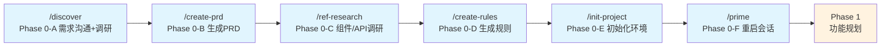
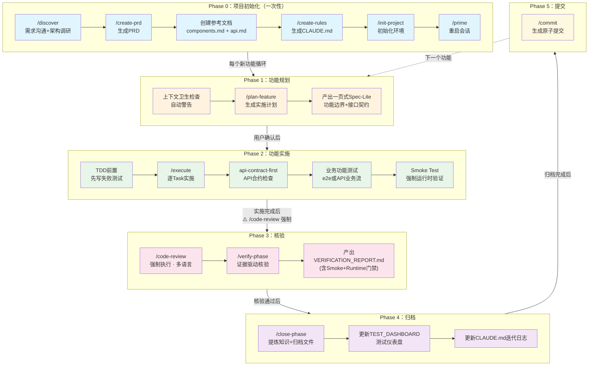

# AI 辅助开发工作流 — AICAM

> 版本: v1.1.0 | 2026-04-21
> 作者: cham (vccham@gmail.com)
> 本文档描述基于当前 `.claude/commands/` + `.claude/skills/` 的完整开发工作流。
> 每个节点标注：**触发方式 | 角色 | 产出物 | 下一步**

### 版本历史

| 版本 | 日期 | 变更说明 |
|------|------|----------|
| v1.0.0 | 2026-04-19 | 初始版本：5 Phase 工作流 + 12 命令 + 5 技能 + Mermaid 可视化 |
| v1.1.0 | 2026-04-21 | 新增 Smoke Test 门禁、TDD 不可豁免范围收紧、⏸️ 状态硬规则、TEST_DASHBOARD 跟踪、技能列表校准（frontend-design 替换 skill-creator） |

---

## 1. 项目概述

**AICAM**（AI-assisted Code workflow for AI Masters）是一套可复用的 AI 辅助开发工作流系统，旨在为 Claude Code 提供标准化的 5 阶段开发生命周期（需求 → 规划 → 实施 → 核验 → 归档），确保每个功能从构思到提交的每一个环节都有据可循、有迹可查。

### 核心特性

| 特性 | 说明 |
|------|------|
| **Phase 驱动** | 5 个阶段明确分工，Phase 0 仅跑一次，后续功能从 Phase 1 循环 |
| **TDD 铁律** | 业务逻辑实现前必须先写失败测试，违反即删除实现代码重来 |
| **双层测试门禁** | 单元测试 + 业务功能测试均通过才允许 Phase 完成 |
| **API 合约优先** | 涉及 API 必须产出 Spec-Lite + 命名映射表，前后端字段一致性强制核验 |
| **渐进式披露** | 上下文按需加载，规划阶段只新增最小必要信息，避免上下文通胀 |
| **上下文自维护** | 归档阶段自动压缩历史知识，CLAUDE.md 迭代日志超 150 行自动摘要 |
| **证据驱动核验** | 每个核验结论必须有文件读取或命令输出为依据，不做猜测性结论 |

### 系统组成

| 组件 | 路径 | 数量 | 用途 |
|------|------|------|------|
| **组件（Commands）** | `.claude/commands/` | 12 个 | `/discover`、`/create-prd`、`/ref-research`、`/create-rules`、`/init-project`、`/prime`、`/plan-feature`、`/execute`、`/code-review`、`/verify-phase`、`/close-phase`、`/commit` |
| **技能（Skills）** | `.claude/skills/` | 5 个 | `agent-browser`、`api-contract-first`、`e2e-test`、`frontend-design`、`ui-ux-pro-max` |
| **参考文档** | `.claude/reference/` | 3 个 + 1 子目录 | `index.md`、`plan-template.md`、`spec-lite-template.md`；`test-strategies/` 子目录含 6 种类型的测试策略（cli/mobile/rest-api/tauri/web/worker） |
| **模板** | `.claude/CLAUDE-template.md` | 1 个 | 新项目初始化时的 CLAUDE.md 种子文件 |
| **计划与规格** | `.agents/` | 2 子目录 | `plans/` 存放实施计划，`specs/` 存放轻量规格 |

### 使用方式

1. **新项目**：将 `.claude/` 目录整体复制到项目根目录，运行 `/discover` 开始
2. **已有项目**：复制到已有项目后，跳过 Phase 0，直接从 `/plan-feature` 开始
3. **迭代**：每个新功能独立走完 5 个 Phase 后归档，CLAUDE.md 保持精简可维护

### 与其他方案的差异

- **不是脚手架**：不生成项目骨架代码，而是定义"AI 如何思考和协作"的过程规范
- **不是模板库**：每个命令都是活的流程脚本，包含门禁、校验、自动触发条件
- **渐进而非全量**：严格限制上下文加载量，通过归档机制保持长期项目的上下文健康

---

## 2. 总览



---

## 3. Phase 0：项目初始化

> 全新项目或新成员加入时执行，已有项目可跳过。
> **核心理念：先对话沟通 + 调研，再产出文档，最后初始化环境。**

### 节点 0-A：需求沟通与架构调研

| 项目 | 内容 |
|------|------|
| **命令** | `/discover [项目构想]` |
| **触发方式** | 手动（用户输入 `/discover`）或自动（用户描述项目构想时 Agent 主动进入） |
| **执行角色** | Agent（主）+ **Sub-agents 并行调研** |
| **动作** | 1. 入口门控：询问用户需求是否已明确还是需要结构化梳理<br>2. **路径 A（明确）**：启动子智能体调研 → 汇总发现 → 检测逻辑缺口 → 进入 0-B<br>3. **路径 B（需梳理）**：逐问澄清（每次一问）→ 提出 2-3 个方案带权衡 → 分段展示设计 → 用户审批 → 写入 design.md → 自我审查 → 用户审查 → 进入 0-B<br>4. **强制门禁**：未达成书面共识，不进入 0-B |
| **产出物** | 共识后的需求清单 + 架构调研摘要；路径 B 额外产出 `docs/specs/YYYY-MM-DD-<topic>-design.md` |
| **前置条件** | 无 |
| **下一步** | → 0-B |

> 注：superpowers `brainstorming` Skill 有 HARD-GATE（必须先设计后实施）。项目的 `/discover` Path A 允许需求明确时跳过头脑风暴，这是项目特定的合法覆盖。选择 Path A 时，向用户确认此覆盖。

### 节点 0-B：生成产品需求文档

| 项目 | 内容 |
|------|------|
| **命令** | `/create-prd [filename]` |
| **触发方式** | 手动，需求沟通达成共识后 |
| **执行角色** | Agent（基于 0-A 的对话内容提取需求） |
| **动作** | 生成 PRD（执行摘要、目标用户、MVP 范围、用户故事、架构、技术栈、迭代计划） |
| **产出物** | `PRD.md` — 产品需求文档，后续所有 Phase 的源头 |
| **下一步** | → 0-C |

### 节点 0-C：前端组件与 API 最佳实践调研及文档化

| 项目 | 内容 |
|------|------|
| **命令** | `/ref-research` |
| **触发方式** | 手动，PRD 创建后（`/create-prd` 完成时会明确提示） |
| **执行角色** | Agent（读取 PRD → 启动子智能体并行网络调研） |
| **动作** | 1. 读取 `docs/PRD.md` 提取技术栈与应用类型<br>2. 判断需要生成哪些参考文档（前端 / API / 两者 / 跳过）<br>3. 并行启动子智能体：Agent A 调研前端组件最佳实践，Agent B 调研 API 设计最佳实践<br>4. 将调研结果写入 `.claude/reference/components.md`（前端组件指南）<br>5. 将调研结果写入 `.claude/reference/api.md`（API 端点指南）<br>6. 更新 `.claude/reference/index.md` 文件索引 |
| **产出物** | `.claude/reference/components.md` + `.claude/reference/api.md` |
| **依赖** | 0-B 产出的 `docs/PRD.md`（0-D `/create-rules` 消费本节点产出） |
| **下一步** | → 0-D |

### 节点 0-D：生成项目规则

| 项目 | 内容 |
|------|------|
| **命令** | `/create-rules` |
| **触发方式** | 手动，参考文档创建后 |
| **执行角色** | Agent（分析代码库约定、技术栈、目录结构 + 引用 0-C 的参考文档） |
| **动作** | 提取命名规范、测试模式、构建命令，生成 CLAUDE.md；在规则中添加对 `components.md` 和 `api.md` 的引用（处理前端组件时阅读前者，处理 API 端点时阅读后者） |
| **产出物** | `CLAUDE.md` — 项目全局规则，AI 每次对话的上下文基础 |
| **下一步** | → 0-E |

### 节点 0-E：初始化本地环境

| 项目 | 内容 |
|------|------|
| **命令** | `/init-project` |
| **触发方式** | 手动，首次本地搭建 |
| **执行角色** | Agent（执行命令）+ 用户（确认关键步骤） |
| **动作** | 复制 .env、安装依赖、启动数据库、跑迁移、启动服务 |
| **产出物** | 本地可运行环境 |
| **下一步** | → 0-F 或 1-A |

### 节点 0-F：重启会话 / 启用新上下文

| 项目 | 内容 |
|------|------|
| **命令** | `/prime` |
| **触发方式** | 手动，Phase 0 全部完成后 |
| **执行角色** | Agent |
| **动作** | 重新加载 CLAUDE.md、PRD.md、reference 文档，启用带有完整项目上下文的新会话 |
| **产出物** | 终端输出的项目概览摘要（携带完整上下文） |
| **下一步** | → Phase 1（功能规划） |

---

## 4. Phase 1：功能规划

> 每个新功能/Phase 开始时执行。**不写代码，只产出计划。**
> **渐进式披露原则**：规划阶段只新增最小必要上下文，优先产出一页式 `Spec-Lite`，避免冗长设计文档。

### 节点 1-A：卫生检查（自动）、

| 项目 | 内容 |
|------|------|
| **命令** | `/plan-feature` 内嵌 Stage 0 |
| **触发方式** | 自动，`/plan-feature` 执行时自动运行 |
| **执行角色** | Agent |
| **动作** | 扫描未归档的 Phase 产物（`*.md` > 300KB），发出警告 |
| **产出物** | 警告信息（如有），不阻塞执行 |
| **停止条件** | 仅警告，不强制停止 |

### 节点 1-B：生成功能实施计划

| 项目 | 内容 |
|------|------|
| **命令** | `/plan-feature [功能描述]` |
| **触发方式** | 手动，用户提出新功能需求 |
| **执行角色** | Agent（+ 可选 Sub-agents 并行调研） |
| **动作** | 5 阶段分析：特性理解 → 代码库调研 → 外部文档调研 → 架构思考 → 生成计划文档 |
| **动作补充（强制）** | 1. 若涉及 API，必须在计划中声明字段命名映射（前端参数名 ↔ 后端参数绑定别名/DTO 字段）<br>2. 必须声明双层测试门禁：`Unit Tests` + `Business Workflow Tests`（UI E2E 或 API 业务流测试）<br>3. 必须生成一页式 `Spec-Lite`（见 1-C），作为实施唯一功能规格来源 |
| **产出物** | `.agents/plans/{phase-name}.md` — 包含：用户故事、上下文引用、文件清单、代码模式、逐步任务、验证命令、验收标准、测试门禁、API 命名映射（如适用） |
| **关键原则** | "Context is King" — 计划必须包含执行 Agent 完成实施所需的一切 |
| **下一步** | → 1-C |

### 节点 1-C：生成轻量规格（Spec-Lite）

| 项目 | 内容 |
|------|------|
| **命令** | `/plan-feature` 内嵌产出 |
| **触发方式** | 自动，1-B 计划生成后 |
| **执行角色** | Agent |
| **动作** | 生成一页式规格：功能边界、非目标、接口契约、命名映射、测试门禁、验收口径 |
| **产出物** | `.agents/specs/{phase-name}.spec.md`（建议控制在 120 行以内） |
| **门禁** | 未产出 Spec-Lite，不进入 2-A |
| **下一步** | 用户 review 计划与 Spec-Lite → 确认 → 2-A |

---

## 5. Phase 2：功能实施

> 严格按计划执行，每个 Task 原子化、可单独验证。

### 节点 2-A：TDD 前置（强制）

| 项目 | 内容 |
|------|------|
| **Skill** | `test-driven-development`（superpowers） |
| **触发方式** | **自动，每个业务逻辑 Task 实施前** |
| **执行角色** | Agent |
| **动作** | 先写目标功能的失败测试 → 运行确认红灯 → 再写最小实现代码 → 运行确认绿灯 |
| **核心原则** | 未见失败测试 = 不知道测试是否有效；跳过红灯阶段即违反 TDD |
| **例外** | 配置文件、迁移脚本、纯样式变更可申请豁免；但 Agent 不得自行决定，必须暂停展示申请并等待用户确认（y/n） |
| **不可豁免（强制 TDD）** | 跨边界集成层（IPC 命令、REST endpoint、事件发布/订阅、消息队列消费者）；前端/UI 组件中含有条件逻辑、状态管理、数据转换的部分；任何序列化/反序列化逻辑；错误处理路径 |
| **豁免申请规则** | 申请上述类型豁免时，必须同时说明"替代验证方式"。若答案为"运行时手动看"，则驳回豁免申请，必须补写测试 |
| **下一步** | → 2-B |

### 节点 2-B：按计划实施

| 项目 | 内容 |
|------|------|
| **命令** | `/execute [plan-file-path]` |
| **触发方式** | 手动，用户确认计划后 |
| **执行角色** | Agent（逐 Task 读取计划 → 实施 → 验证） |
| **动作** | 按顺序执行计划中所有 Tasks → 每 Task 后验证语法/编译 → 运行计划指定的所有验证命令 |
| **产出物** | 实际代码文件 + `.agents/plans/{plan-name}.summary.md`（执行摘要，含 `## TDD Log` 节记录每个 Task 的红绿状态） |
| **停止条件（强制）** | 任一验证命令失败则修复后继续，不跳过；`Unit Tests` 与 `Business Workflow Tests` 任一失败都阻塞 Phase 完成 |
| **下一步** | → 2-C（如涉及 API）或 2-D（E2E）或 3-A |

### 节点 2-C：API 合约一致性检查

| 项目 | 内容 |
|------|------|
| **Skill** | `api-contract-first` |
| **触发方式** | **自动**（当操作涉及 API 控制器/业务服务/数据传输层目录，或用户提到 "API contract"/"OpenAPI"/"frontend-backend" 等关键词） |
| **执行角色** | Agent（在实施或 review 过程中自动加载此 Skill） |
| **动作** | 后端先定义 API → 从 `/api-docs`（或项目等价路径）生成 OpenAPI Spec → 前端对照 Spec 编写 services/types → 核验参数绑定别名命名、响应结构、枚举值 |
| **产出物** | 一致性核验报告（终端输出）；如有不一致则修复代码并回写到 Spec-Lite 的命名映射表 |
| **常见陷阱** | JSON 命名策略注解（如 Java `@JsonNaming`）只影响 body 序列化，不影响 URL 查询参数绑定 |
| **下一步** | → 2-D 或 3-A |

### 节点 2-D：业务功能测试（强制）

| 项目 | 内容 |
|------|------|
| **Skill** | `e2e-test`（有前端时） / API 业务流测试（无前端时） |
| **触发方式** | **自动建议 + 默认执行**，实施完成后必须执行 |
| **执行角色** | Agent（有前端时调用 `e2e-test`，其内部使用 `agent-browser`） |
| **动作** | 覆盖核心业务流程：关键路径、失败路径、权限路径；验证 UI/API 与数据一致性 |
| **产出物** | 业务功能测试报告（含截图或 API 调用证据） |
| **前置条件** | 若无前端，则改为 API 级业务流程测试，不可跳过 |
| **下一步** | → 3-A |

### 节点 2-E：Smoke Test（强制，不可跳过）

| 项目 | 内容 |
|------|------|
| **命令** | `/execute` 内嵌步骤 |
| **触发方式** | **自动**，所有验证命令通过后必须执行 |
| **执行角色** | Agent |
| **动作** | 1. 读取计划文件 `## Smoke Test Checklist`，逐条验证<br>2. 启动应用/服务 → 验证无崩溃<br>3. 逐条执行 Checklist 条目，记录 ✅ PASS / ❌ FAIL<br>4. 任何 ❌ → 进入 bug 修复流程，修复后重新执行完整 Smoke Test |
| **门禁规则** | 计划文件缺少 `## Smoke Test Checklist` → STOP，提示补充或需用户书面确认跳过<br>全部 ✅ 才能生成 Summary<br>结果写入 `.agents/plans/{phase-name}.summary.md` 的 `## Smoke Test Log` 节 |
| **产出物** | summary.md 中的 `## Smoke Test Log` 表格（含操作→预期→结果） |
| **下一步** | → 3-A |

---

## 6. Phase 3：核验

> 独立于实施的审计阶段，产出正式核验报告供归档使用。

### 节点 3-A：Code Review（**强制**）

| 项目 | 内容 |
|------|------|
| **命令** | `/code-review [plan-file-path]` |
| **触发方式** | **强制执行**：`/execute` 完成后必须执行，`/verify-phase` 前置门禁 |
| **执行角色** | Agent（上下文隔离执行）|
| **上下文隔离** | ⚠️ 必须在**新会话**中执行，避免实现经过污染评审判断 |
| **动作** | 1. 无参数时列出 `.agents/plans/` 文件供用户选择；有参数时展示 plan 文件路径等待确认<br>2. 三层范围解析（plan 声明 → git delta → fallback）确定 review 文件列表<br>3. 检测语言分布（Rust / TS / Python / Java / Go 等多语言混合支持）<br>4. 执行 6 大通用维度 + 语言专项检查（含 KNOWN_TRADEOFFS / DEFERRED_ITEMS 防误报）<br>5. 将结构化报告写入 `.agents/reviews/{phase}-code-review.md`（仅存档，不自动加载）<br>6. Critical 问题 → 立即阻断，展示问题 + 修复建议，等待处理后继续 |
| **产出物** | `.agents/reviews/{phase-name}-code-review.md`（存档文件，不进入 AI 上下文）|
| **核心原则** | reviewer 只看产物与设计决策文档，不接触规划会话历史，保证评审客观性 |
| **门禁规则** | Critical 问题 > 0 → `⛔ BLOCKED`，不允许进入 3-B；全部 Critical 清零 → `✅ PASSED` |
| **下一步** | → 3-B |

### 节点 3-B：核验阶段实施成果

| 项目 | 内容 |
|------|------|
| **命令** | `/verify-phase [phase-name 或 plan-file-path]` |
| **前置** | 3-A Code Review 建议先于此执行 |
| **触发方式** | 手动，`/execute` 完成后 |
| **执行角色** | Agent（证据驱动，每个发现必须有文件读取或命令输出为依据） |
| **动作** | 定位产物 → 解析计划期望清单 → 文件存在性审计 → 运行所有验证命令 → 验收标准逐条核验 → 整理 Bug 目录 |
| **产出物** | `.agents/reports/PHASE{N}_VERIFICATION_REPORT.md` —— 标准化核验报告 |
| **报告结构** | 环境依赖 / Task 完成情况 / 验证命令结果 / Bug 清单 / 验收标准 / 修复优先级 |
| **强制核验项** | 必须包含 `Unit Tests` 与 `Business Workflow Tests` 的命令输出与结论；涉及 API 时必须包含命名映射一致性结论 |
| **⏸️ 状态硬规则** | `⏸️ 需手动验证` 在任何 Gate 中均视为 ❌，不允许以此通过；Business Workflow Tests 为 ⏸️ 时必须提供可执行的自动化脚本（使用 mock/fixture），或用户明确书面确认"延期至下一 Phase"并标注风险；Smoke Test Log 缺失或存在 ⏸️ 条目 → Smoke Test Gate 状态为 ❌，阻断 Phase 关闭 |
| **核心原则** | Evidence over assumption；验证是只读的，不自动大范围修改代码 |
| **下一步** | 用户查看报告 → 决定修复 Bug → 4-A |

---

## 7. Phase 4：归档

> Phase 完成（或核验通过）后执行，压缩上下文、释放预算。

### 节点 4-A：关闭 Phase、提炼知识

| 项目 | 内容 |
|------|------|
| **命令** | `/close-phase [phase-name]` |
| **触发方式** | 手动，核验报告产出后、用户确认可归档 |
| **执行角色** | Agent（**操作前展示预览，等待用户确认**） |
| **动作** | 扫描 Phase 产物 → 提取 Bug/偏差/教训 → 写入 CLAUDE.md 迭代日志（15-30 行） → 将详细文件 mv 到 `archive/` → 清理冗余副本 → 更新 `.agents/reports/TEST_DASHBOARD.md` |
| **产出物** | 更新后的 `CLAUDE.md`（含迭代日志条目） + `archive/` 中的历史文件 |
| **安全规则** | 不归档 CLAUDE.md / PRD.md / 进行中的 Phase；移动前必须用户确认 |
| **上下文收益** | 将数百行原始文档压缩为 15-30 行摘要，释放 AI 上下文预算 |
| **下一步** | → 5-A |

### 节点 4-B：更新测试仪表盘

| 项目 | 内容 |
|------|------|
| **命令** | `/close-phase` 内嵌步骤 |
| **触发方式** | 自动，归档完成后 |
| **执行角色** | Agent |
| **动作** | 1. 更新 `.agents/reports/TEST_DASHBOARD.md`（不存在则创建）<br>2. 追加/更新本 Phase 一行到"Phase 覆盖矩阵"和"跨 Phase 趋势"表<br>3. 填入 Gate 汇总（从 Verification Report）、单元测试明细、Smoke Test 明细（含每条操作→预期→结果）、业务流程测试明细（含 Mock 方案） |
| **产出物** | 更新后的 `TEST_DASHBOARD.md` |
| **上下文规则** | TEST_DASHBOARD.md **不加入 CLAUDE.md context loading**，仅供人工查阅 |
| **下一步** | → 5-A |

---

## 8. Phase 5：提交

### 节点 5-A：生成原子提交

| 项目 | 内容 |
|------|------|
| **命令** | `/commit` |
| **触发方式** | 手动，归档完成后 / 每个稳定里程碑 |
| **执行角色** | Agent |
| **动作** | `git status && git diff HEAD` → 分析变更 → 生成语义化提交信息（feat/fix/docs 等标签） → `git add` + `git commit` |
| **产出物** | Git 提交记录 |
| **下一步** | → 下一个 Phase 的 1-A |

---

## 9. 完整工作流图



---

## 10. 角色说明

| 角色 | 职责 |
|------|------|
| **用户** | 提出需求、review 计划和报告、做关键决策（是否归档、是否修复 Bug）、确认破坏性操作 |
| **Agent（主）** | 执行命令、读写文件、运行验证命令、协调整体流程 |
| **Sub-agents（并行）** | 在 Phase 0 需求调研、`/plan-feature` 和 `/e2e-test` 中并行执行代码库调研、外部文档获取，加速规划 |

---

## 11. 产出物清单

| 产出物 | 生成命令 | 归宿 |
|--------|----------|------|
| `CLAUDE.md` | `/create-rules` | 项目根目录，永久保留 |
| `PRD.md` | `/create-prd` | 项目根目录，永久保留 |
| `docs/specs/YYYY-MM-DD-<topic>-design.md` | `/discover` (Path B) | 项目文档目录，Phase 0 完成后归档 |
| `.claude/reference/components.md` | Phase 0 节点 0-C | 项目根目录，永久保留 |
| `.claude/reference/api.md` | Phase 0 节点 0-C | 项目根目录，永久保留 |
| `.agents/plans/{phase}.md` | `/plan-feature` | 执行后 → `archive/` |
| `.agents/plans/{phase}.summary.md` | `/execute` 末尾自动 | 执行后 → `archive/` |
| `.agents/reports/PHASE{N}_VERIFICATION_REPORT.md` | `/verify-phase` | 核验后 → `archive/` |
| `.agents/reports/TEST_DASHBOARD.md` | `/close-phase` | 永久保留，人工查阅 |
| `CLAUDE.md 迭代日志条目` | `/close-phase` | 永久保留（压缩形式） |
| Git 提交 | `/commit` | 版本历史 |

---

## 11-A. 目录结构说明

> 以下目录均为 AICAM 工作流的运行时产物目录，与项目源代码目录严格分离。

### 工作流目录

```
.claude/                        # AICAM 工作流系统目录（不含项目业务代码）
├── commands/                   # 12 个 slash 命令脚本（/discover、/execute 等）
├── skills/                     # 领域专项 Skill（api-contract-first、ui-ux-pro-max 等）
├── reference/                  # 按需加载的参考文档（components.md、api.md 等）
│   ├── index.md                # 参考文档索引，说明各文档的加载时机
│   ├── plan-template.md        # 功能实施计划模板（含 Smoke Test Checklist + Mock Strategy）
│   ├── spec-lite-template.md   # 轻量规格模板
│   └── test-strategies/        # 6 种项目类型的测试策略
│       ├── cli.md              # CLI 项目测试策略
│       ├── mobile.md           # 移动端测试策略
│       ├── rest-api.md         # REST API 测试策略
│       ├── tauri.md            # Tauri 桌面应用测试策略
│       ├── web.md              # Web 应用测试策略
│       └── worker.md           # Worker/服务端测试策略
├── CLAUDE-template.md          # 新项目初始化时的 CLAUDE.md 种子文件
└── WORKFLOW.md                 # 本文档：工作流全局说明

.agents/                        # AI Agent 运行时产物目录（所有阶段产出集中于此）
├── plans/                      # 实施计划文件（/plan-feature 产出）
│   ├── {phase-name}.md         # 原始计划：任务列表、验证命令、验收标准
│   ├── {phase-name}.summary.md # 执行摘要：/execute 完成后自动生成，记录偏差与测试清单
│   └── archive/                # 已归档的旧 Phase 计划（/close-phase 后移入）
├── specs/                      # 轻量规格文件（/plan-feature 内嵌产出）
│   └── {phase-name}.spec.md    # Spec-Lite：功能边界、接口契约、AC 编号列表（建议 ≤120 行）
├── reviews/                    # Code Review 报告（/code-review 产出）
│   └── {phase-name}-code-review.md  # 证据存档，不自动加载，/verify-phase 仅检查存在性
└── reports/                    # 核验报告（/verify-phase 产出）
    └── PHASE{N}_VERIFICATION_REPORT.md  # 含 AC 覆盖矩阵，归档时移入 archive/

docs/                           # 项目文档目录（业务/设计文档，非工作流系统）
└── specs/                      # 设计文档（/discover Path B 产出）
    └── YYYY-MM-DD-{topic}-design.md  # 完整设计稿：架构决策、API 设计、数据模型

archive/                        # 历史归档目录（/close-phase 后归集）
└── Phase{N}/                   # 按 Phase 分组
    ├── {plan}.md               # 原始计划归档
    ├── summary.md              # 执行摘要归档（AC ↔ test 追踪链入口）
    └── VERIFICATION_REPORT.md  # 核验报告归档（AC 覆盖矩阵留存）
```

### 各目录对比

| 目录 | 生命周期 | 写入命令 | 读取命令 | 是否进入 AI 上下文 |
|------|---------|---------|---------|-----------------|
| `.claude/commands/` | 永久 | 手动维护 | 所有命令触发时 | ✅ 按需加载指令 |
| `.claude/reference/` | 永久 | `/ref-research` | 明确引用时 | ✅ 按需加载（硬隔离） |
| `.claude/reference/test-strategies/` | 永久 | `/execute`、`/verify-phase` | TDD 阶段按项目类型加载 | ✅ 按需加载 |
| `.agents/plans/` | Phase 生命周期 | `/plan-feature`、`/execute` | `/execute`、`/verify-phase` | ✅ 执行期主动读取 |
| `.agents/specs/` | Phase 生命周期 | `/plan-feature` | `/execute`、`/verify-phase` | ✅ 执行期主动读取 |
| `.agents/reviews/` | Phase 生命周期 | `/code-review` | `/verify-phase`（仅存在性检查） | ❌ 仅存档，不加载 |
| `.agents/reports/` | Phase 生命周期 | `/verify-phase` | `/close-phase`（仅 Summary 节） | ⚠️ 仅读取摘要节 |
| `docs/specs/` | 永久（设计参考） | `/discover` (Path B) | `/plan-feature` 按需 | ⚠️ 按需引用 |
| `archive/` | 永久历史 | `/close-phase` | 追溯时手动 | ❌ 归档后不自动加载 |

---

## 11-B. 测试用例追踪链

每个 Phase 的测试用例通过两层文档形成完整的 AC ↔ Test 追踪链，无需全库扫描，不增加执行期上下文。

### 追踪链结构

```
Spec-Lite (AC-N 编号)
    ↓ 实施时
summary.md → ## Test Cases 表格
    （测试文件 / 测试用例名 / 覆盖 AC / 结果）
    ↓ 核验时
.agents/reports/PHASE{N}_VERIFICATION_REPORT.md → ## 六、AC-Test 覆盖矩阵
    （AC ID / 验收标准 / 覆盖测试用例 / 测试文件 / 测试结果 / 状态）
    ↓ 归档后
archive/Phase{N}/summary.md + archive/Phase{N}/VERIFICATION_REPORT.md
    ↑ 历史追溯入口：CLAUDE.md 迭代日志 → archive/Phase{N}/
```

### 两层文档说明

| 文档 | 生成时机 | 内容 | 用途 |
|------|----------|------|------|
| `summary.md ## Test Cases` | `/execute` 完成时 | 本 Phase 新增的所有测试（单元/流程） | 记录"写了什么测试" |
| `VERIFICATION_REPORT.md ## 六、AC-Test 覆盖矩阵` | `/verify-phase` 核验时 | AC 逐条 × 对应测试用例的覆盖状态 | 验证"每条 AC 是否被覆盖" |

### 无覆盖 AC 的处理规则

- 矩阵中标 `⚠ 无覆盖` 的 AC 自动列入报告修复优先级（七、修复优先级建议）。
- 无覆盖不阻塞 Phase 关闭，但需在 CLAUDE.md 迭代日志中备注。

### 历史追溯路径

```
CLAUDE.md 迭代日志
    → 找到 Phase{N} 条目
    → archive/Phase{N}/summary.md        ← 该 Phase 测试清单
    → archive/Phase{N}/VERIFICATION_REPORT.md  ← 该 Phase AC 覆盖矩阵
    → archive/Phase{N}/{plan}.md         ← 原始计划含 Spec-Lite AC 列表
```

---

## 12. Skill 自动触发条件

| Skill | 自动触发条件 |
|-------|-------------|
| `api-contract-first` | 操作 API 控制器/业务服务/数据传输层目录；或用户提到 "API contract"、"OpenAPI"、"swagger"、"frontend-backend"、"field mapping"；**涉及 API 即强制执行命名映射核验** |
| `e2e-test` | 有前端且进入业务功能测试阶段时自动建议并默认执行 |
| `agent-browser` | `e2e-test` Skill 内部调用 |
| `frontend-design` | 涉及前端 UI 组件/页面/样式实现时自动加载；用户提到 "组件"、"页面"、"样式"、"布局"、"响应式"、"动画" |
| `ui-ux-pro-max` | 涉及前端 UI 设计/组件/配色/布局/动效时自动加载；用户提到 "UI"、"UX"、"设计"、"样式"、"组件"、"配色"、"dark mode"、"响应式" |
| `skill-creator` | 需要创建、修改、优化或评估任何 Skill 本身时加载；用于保持工作流 skill 的质量与触发准确性。加载路径：VS Code 扩展内置，非工作区 `.claude/skills/` |
| `test-driven-development`（superpowers 内置） | **Phase 2 实施每个 Task 前自动加载**；实现新功能、修复 bug、重构行为变更时，要求先写失败测试再写实现代码 |
| `systematic-debugging`（superpowers 内置） | 遇到 bug、测试失败、非预期行为时立即加载；**禁止在定位根因前提出修复方案** |
| `requesting-code-review`（superpowers 内置） | Phase 3 核验通过后、进入 commit 前；或实施重大功能后建议执行；派发独立 code-reviewer subagent 进行审查 |

## 13. MCP / Plugin 工具（按需调用，零上下文消耗）

> 以下工具为 Plugin/MCP，不加载文档，仅在 Agent 主动调用时执行，上下文负担为零。

| 工具 | 能力 | 最适用阶段 |
|------|------|------------|
| `serena` | 符号级语义导航、跨文件重命名/引用查找、40+ 语言支持；大型复杂代码库中替代逐行 grep | Phase 2 实施（大型项目重构/导航） |
| `typescript-lsp` | TypeScript 语言服务器：语义类型检查、符号分析、未运行编译器即可发现类型错误 | Phase 2 实施（TS 项目）+ Phase 3 核验命令 |

---

## 14. 关键原则

1. **Phase 0 只跑一次**，后续每个功能从 Phase 1 开始循环
2. **计划不写代码**，实施不改计划结构（发现需要改计划，先暂停与用户确认）
3. **验证命令失败必须修复**，不允许跳过进入下一步
4. **每个 Phase 必须通过双层测试门禁**：`Unit Tests` + `Business Workflow Tests`
4.5. **每个 Phase 必须通过 Smoke Test**：计划中声明的 `Smoke Test Checklist` 全部 ✅ 才能归档
5. **涉及 API 必须有 Spec + 命名映射表**，并通过 `api-contract-first` 一致性核验
6. **归档前必须用户确认**，`/close-phase` 展示预览后等待确认
7. **CLAUDE.md 是唯一的活体上下文**，所有历史知识压缩提炼于此
8. **高危数据操作必须用户确认**：`TRUNCATE`、`DROP`、无条件 `DELETE` 等不可逆操作，Agent 必须停止执行、展示影响范围，等待用户明确确认，不允许自动推进；迁移脚本禁止包含 `TRUNCATE`/`DROP TABLE`，数据清理必须走独立 data-fix 脚本
8.5. **⏸️ 状态硬规则**：`⏸️ 需手动验证` 在任何门禁中均视为 ❌，不允许以此通过 Phase
9. **TDD 不可豁免范围**：跨边界集成层（IPC/REST/事件/消息队列）、含条件逻辑的 UI 组件、序列化/反序列化逻辑、错误处理路径。申请豁免需同时说明替代验证方式
10. **命令文件风格约定**：过程指令使用英文（AI 理解更精确），输出模板/报告使用中文（面向用户阅读）
11. **Phase 0-A 设计未审批**（路径 B）或**需求缺口未解决**（路径 A），不进入 0-B（`/create-prd`）
12. **CLAUDE.md 迭代日志超过 150 行自动压缩**，保留最近 2 个 Phase 的完整条目，早期 Phase 压缩为单行摘要（范围 + 关键 Bug/教训 + `archive/` 指引）。
13. **Skill 加载优先级**：项目命令 > superpowers 补充 Skill > 其他 Skill。当项目命令已包含某能力时，不额外加载 superpowers 同功能 Skill：
    - `/discover` 已包含头脑风暴 → 不加载 `brainstorming`
    - `/plan-feature` 已包含规划 → 不加载 `writing-plans`
    - `/execute` 已包含实施 → 不加载 `executing-plans` / `subagent-driven-development`
    仅加载 superpowers 的纪律检查类 Skill：`test-driven-development`、`systematic-debugging`、`verification-before-completion`、`requesting-code-review` + `receiving-code-review`、`dispatching-parallel-agents`。
14. **不使用的 superpowers Skills**（与项目架构冲突）：
    - `executing-plans` / `subagent-driven-development`：强制 git worktree，项目使用当前分支直接执行
    - `finishing-a-development-branch`：处理 PR/merge 流，项目用 /commit
    - `using-git-worktrees`：项目不支持 worktree 模式
    - `using-superpowers`：元技能会强制加载 brainstorming，与 /discover Path A 冲突

---

## 15. 引用与致谢

AICAM 工作流系统的设计与实现参考了以下开源社区思路与最佳实践，在此致谢：

| 来源 | 参考内容 |
|------|----------|
| [Cursor AI](https://cursor.sh) | AI 辅助开发的渐进式上下文管理理念 |
| [Claude Code 官方文档](https://docs.anthropic.com/en/docs/claude-code/overview) | slash commands、skills、MCP 的架构设计 |
| [superpowers for Claude](https://github.com/cparker/superhooks)（开源社区） | TDD 门禁、并行 agent 调度、worktree 隔离、verification-before-completion 等纪律检查类 Skill |
| [Agentic Development Patterns](https://simonwillison.net/) | AI agent 协作模式、子智能体调研策略 |
| [API-First Design](https://apisyouwonthate.com/) | API 合约优先方法论、OpenAPI 作为单一真相源 |
| [Specification by Example](https://specificationbyexample.com/) | Spec-Lite 轻量规格设计理念 |
| [Domain-Driven Design](https://domainlanguage.com/ddd/) | 分层架构、领域边界划分原则 |
| [Test-Driven Development by Example](https://www.amazon.com/Test-Driven-Development-Kent-Beck/dp/0321146530) | TDD 红-绿-重构循环的铁律实践 |
| [GitOps Principles](https://www.gitops.tech/) | 原子提交、分支隔离、代码审查流程 |

> AICAM 并非对上述方案的简单拼接，而是将其核心思想融合为**统一的 5 阶段开发生命周期**，每个节点均可跨语言、跨平台复用。