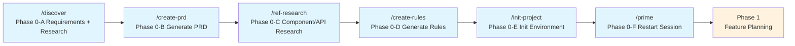
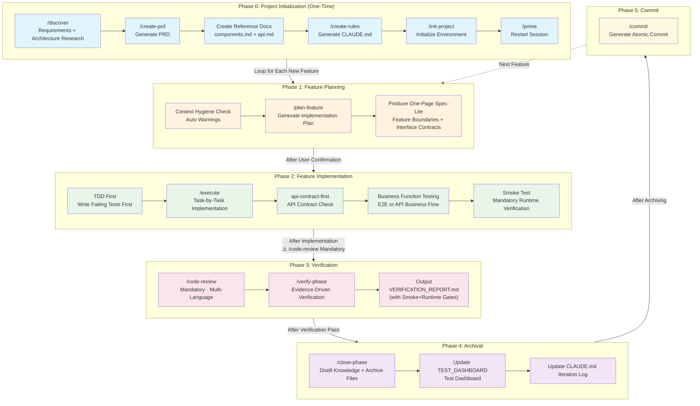

# AI-Assisted Development Workflow — AICAM

> Version: v1.2.0 | 2026-04-23
> Author: cham (vccham@gmail.com)
> This document describes the complete development workflow based on the current `.claude/commands/` + `.claude/skills/`.
> Each node is labeled with: **Trigger | Role | Output | Next Step**

### Version History

| Version | Date | Changes |
|---------|------|---------|
| v1.0.0 | 2026-04-19 | Initial release: 5-Phase workflow + 12 commands + 5 skills + Mermaid visualization |
| v1.1.0 | 2026-04-21 | Added Smoke Test gate, tightened TDD exemption scope, ⏸️ hard-fail rule, TEST_DASHBOARD tracking, skills list correction (frontend-design replaces skill-creator) |
| v1.2.0 | 2026-04-23 | Added Simplicity First / Surgical Changes / explicit Skill activation rules; removed ui-ux-pro-max (missing core scripts); workspace skills trimmed to 4; reference index internationalized |

---

## 1. Project Overview

**AICAM** (AI-assisted Code workflow for AI Masters) is a reusable AI-assisted development workflow system designed to provide Claude Code with a standardized 5-phase development lifecycle (Requirements → Planning → Implementation → Verification → Archival), ensuring that every feature from conception to submission follows a documented and auditable process.

### Key Features

| Feature | Description |
|---------|-------------|
| **Phase-Driven** | 5 clearly defined phases; Phase 0 runs once, subsequent features loop from Phase 1 |
| **TDD Iron Rule** | Tests must be written and fail before business logic is implemented; violations require deletion of implementation code and restart |
| **Dual-Layer Test Gate** | Unit tests + business workflow tests must both pass for a Phase to be completed |
| **API Contract First** | API features require a Spec-Lite + naming mapping table; frontend-backend field consistency is strictly enforced |
| **Progressive Disclosure** | Context loaded on demand; planning phase adds only minimal necessary context to avoid context inflation |
| **Self-Maintaining Context** | Archival phase automatically compresses historical knowledge; CLAUDE.md iteration logs auto-summarize when exceeding 150 lines |
| **Evidence-Driven Verification** | Every verification conclusion must be backed by file reads or command output — no speculative conclusions |

### System Components

| Component | Path | Count | Purpose |
|-----------|------|-------|---------|
| **Commands** | `.claude/commands/` | 13 | `/discover`, `/create-prd`, `/ref-research`, `/create-rules`, `/init-project`, `/prime`, `/plan-feature`, `/execute`, `/code-review`, `/verify-phase`, `/close-phase`, `/commit`, `/hotfix` |
| **Skills** | `.claude/skills/` | 4 | `agent-browser`, `api-contract-first`, `e2e-test`, `frontend-design` |
| **Reference Docs** | `.claude/reference/` | 3 + 1 subdir | `index.md`, `plan-template.md`, `spec-lite-template.md`; `test-strategies/` subdir with 6 type-specific strategies (cli/mobile/rest-api/tauri/web/worker) |
| **Template** | `.claude/CLAUDE-template.md` | 1 | Seed file for CLAUDE.md during new project initialization (includes Simplicity First / Surgical Changes rules + Skill activation rules + test command categories) |
| **Plans & Specs** | `.agents/` | 2 subdirectories | `plans/` stores implementation plans, `specs/` stores lightweight specs |

### Usage

1. **New Project**: Copy the `.claude/` directory to the project root, then run `/discover` to begin.
2. **Existing Project**: Copy to an existing project, skip Phase 0, start directly from `/plan-feature`.
3. **Iteration**: Each feature independently completes all 5 phases before archiving; CLAUDE.md stays lean and maintainable.

### CLAUDE-template.md Key Features

`CLAUDE-template.md` is the seed file for the project's `CLAUDE.md`, generated by `/init-project`. It includes the following key constraints:

| Feature | Description |
|---------|-------------|
| **Simplicity First** | Write minimum code to meet current Spec-Lite AC — no speculative features; no abstractions unless reused ≥2 places in this Phase; no error handling for scenarios not defined in the Spec-Lite |
| **Surgical Changes** | Touch only what the request requires — no "improving" adjacent code/comments/formatting; follow existing code style; note unrelated dead code but never delete silently; clean up unused imports/variables from your own changes |
| **Skill Activation Rules** | Enforced (not relying on auto-match): frontend components/pages → `frontend-design`; API definition/field mapping → `api-contract-first`; business workflow testing → `e2e-test` |
| **Test Command Categories** | Split into Unit tests / Business workflow tests / Single file targeted — strategy docs referenced at `.claude/reference/test-strategies/{type}.md` |

### Differences from Other Approaches

- **Not a scaffolding tool**: It does not generate project boilerplate code. Instead, it defines process rules for "how AI should think and collaborate."
- **Not a template library**: Every command is a living process script with gates, validations, and automatic trigger conditions.
- **Progressive, not bulk**: Strictly limits context loading, maintaining context health in long-term projects through an archival mechanism.

---

## 2. Overview



---

## 3. Phase 0: Project Initialization

> Execute when starting a new project or when a new team member joins. Skip for existing projects.
> **Core idea: Communicate and research first, then produce documents, then initialize the environment.**

### Node 0-A: Requirements Discussion & Architecture Research

| Item | Content |
|------|---------|
| **Command** | `/discover [project idea]` |
| **Trigger** | Manual (user types `/discover`) or automatic (Agent proactively engages when user describes a project idea) |
| **Role** | Agent (primary) + **Sub-agents for parallel research** |
| **Actions** | 1. Entry gate: Ask whether user requirements are already clear or need structured梳理<br>2. **Path A (Clear)**: Launch sub-agent research → consolidate findings → detect logic gaps → proceed to 0-B<br>3. **Path B (Needs Structuring)**: Clarify questions one at a time → propose 2-3 options with trade-offs → present design in segments → user approval → write to design.md → self-review → user review → proceed to 0-B<br>4. **Mandatory gate**: No proceeding to 0-B without written consensus |
| **Output** | Consolidated requirements list + architecture research summary; Path B additionally produces `docs/specs/YYYY-MM-DD-<topic>-design.md` |
| **Prerequisites** | None |
| **Next Step** | → 0-B |

> Note: The superpowers `brainstorming` Skill has a HARD-GATE (design before implementation). This project's `/discover` Path A allows skipping brainstorming when requirements are already clear — a project-specific, legitimate override. When choosing Path A, confirm this override with the user.

### Node 0-B: Generate Product Requirements Document

| Item | Content |
|------|---------|
| **Command** | `/create-prd [filename]` |
| **Trigger** | Manual, after consensus is reached during requirements discussion |
| **Role** | Agent (extracts requirements from 0-A conversation) |
| **Actions** | Generate a PRD (executive summary, target users, MVP scope, user stories, architecture, tech stack, iteration plan) |
| **Output** | `PRD.md` — Product Requirements Document, the source for all subsequent phases |
| **Next Step** | → 0-C |

### Node 0-C: Frontend Component & API Best Practices Research and Documentation

| Item | Content |
|------|---------|
| **Command** | `/ref-research` |
| **Trigger** | Manual, after PRD is created (explicitly prompted when `/create-prd` completes) |
| **Role** | Agent (reads PRD → launches sub-agents for parallel web research) |
| **Actions** | 1. Read `docs/PRD.md` to extract tech stack and application type<br>2. Determine which reference docs to generate (frontend / API / both / skip)<br>3. Launch sub-agents in parallel: Agent A researches frontend component best practices, Agent B researches API design best practices<br>4. Write findings to `.claude/reference/components.md` (frontend component guide)<br>5. Write findings to `.claude/reference/api.md` (API endpoint guide)<br>6. Update `.claude/reference/index.md` file index |
| **Output** | `.claude/reference/components.md` + `.claude/reference/api.md` |
| **Dependencies** | `docs/PRD.md` from 0-B (consumed by 0-D `/create-rules`) |
| **Next Step** | → 0-D |

### Node 0-D: Generate Project Rules

| Item | Content |
|------|---------|
| **Command** | `/create-rules` |
| **Trigger** | Manual, after reference documents are created |
| **Role** | Agent (analyzes codebase conventions, tech stack, directory structure + references 0-C docs) |
| **Actions** | Extract naming conventions, testing patterns, build commands; generate CLAUDE.md; add references to `components.md` and `api.md` in the rules (read the former when working on frontend components, the latter when working on API endpoints) |
| **Output** | `CLAUDE.md` — Project-wide rules, the context foundation for every AI conversation |
| **Next Step** | → 0-E |

### Node 0-E: Initialize Local Environment

| Item | Content |
|------|---------|
| **Command** | `/init-project` |
| **Trigger** | Manual, first-time local setup |
| **Role** | Agent (executes commands) + User (confirms key steps) |
| **Actions** | Copy .env, install dependencies, start database, run migrations, start services |
| **Output** | A locally runnable environment |
| **Next Step** | → 0-F or 1-A |

### Node 0-F: Restart Session / Enable New Context

| Item | Content |
|------|---------|
| **Command** | `/prime` |
| **Trigger** | Manual, after all of Phase 0 is complete |
| **Role** | Agent |
| **Actions** | Reload CLAUDE.md, PRD.md, reference docs; enable a new session with full project context |
| **Output** | Terminal output of a project overview summary (carrying full context) |
| **Next Step** | → Phase 1 (Feature Planning) |

---

## 4. Phase 1: Feature Planning

> Execute at the start of each new feature/phase. **No coding — only plans.**
> **Progressive disclosure**: Planning adds only minimal necessary context, prioritizing a one-page `Spec-Lite` to avoid lengthy design documents.

### Node 1-A: Hygiene Check (Automatic)

| Item | Content |
|------|---------|
| **Command** | `/plan-feature` embedded Stage 0 |
| **Trigger** | Automatic, runs when `/plan-feature` is executed |
| **Role** | Agent |
| **Actions** | Scan unarchived Phase artifacts (`*.md` > 300KB), emit warnings |
| **Output** | Warning messages (if any), does not block execution |
| **Stop Condition** | Warning only, no forced stop |

### Node 1-B: Generate Feature Implementation Plan

| Item | Content |
|------|---------|
| **Command** | `/plan-feature [feature description]` |
| **Trigger** | Manual, when user proposes a new feature requirement |
| **Role** | Agent (+ optional sub-agents for parallel research) |
| **Actions** | 5-stage analysis: feature understanding → codebase research → external doc research → architectural thinking → generate plan document |
| **Mandatory Additions** | 1. If APIs are involved, the plan must declare field naming mappings (frontend param names ↔ backend param binding aliases/DTO fields)<br>2. Must declare dual-layer test gates: `Unit Tests` + `Business Workflow Tests` (UI E2E or API business flow tests)<br>3. Must generate a one-page `Spec-Lite` (see 1-C) as the sole functional spec source for implementation |
| **Output** | `.agents/plans/{phase-name}.md` — includes: user stories, context references, file list, code patterns, step-by-step tasks, verification commands, acceptance criteria, test gates, API naming mappings (if applicable) |
| **Key Principle** | "Context is King" — the plan must contain everything the executing Agent needs to complete implementation |
| **Next Step** | → 1-C |

### Node 1-C: Generate Lightweight Spec (Spec-Lite)

| Item | Content |
|------|---------|
| **Command** | `/plan-feature` embedded output |
| **Trigger** | Automatic, after 1-B plan is generated |
| **Role** | Agent |
| **Actions** | Generate a one-page spec: feature boundaries, non-goals, interface contracts, naming mappings, test gates, acceptance criteria |
| **Output** | `.agents/specs/{phase-name}.spec.md` (recommended to keep under 120 lines) |
| **Gate** | No proceeding to 2-A without a Spec-Lite |
| **Next Step** | User reviews plan and Spec-Lite → confirms → 2-A |

---

## 5. Phase 2: Feature Implementation

> Strictly follow the plan; each Task is atomic and independently verifiable.

### Node 2-A: TDD First (Mandatory)

| Item | Content |
|------|---------|
| **Skill** | `test-driven-development` (superpowers) |
| **Trigger** | **Automatic, before every business logic Task is implemented** |
| **Role** | Agent |
| **Actions** | Write failing test for the target feature → run and confirm red → write minimal implementation code → run and confirm green |
| **Core Principle** | No failing test seen = don't know if the test is valid; skipping the red phase violates TDD |
| **Exceptions** | Config files, migration scripts, pure style changes may apply for exemption; but the Agent cannot decide unilaterally — must pause, display the request, and wait for user confirmation (y/n) |
| **Non-Exempt (Mandatory TDD)** | Cross-boundary integration layers (IPC commands, REST endpoints, event pub/sub, message queue consumers); frontend/UI components with conditional logic, state management, data transformation; any serialization/deserialization logic; error handling paths |
| **Exemption Request Rule** | When requesting exemption for the above types, must also state the "alternative verification method." If the answer is "manual runtime inspection," the exemption is rejected — tests must be written |
| **Next Step** | → 2-B |

### Node 2-B: Implement According to Plan

| Item | Content |
|------|---------|
| **Command** | `/execute [plan-file-path]` |
| **Trigger** | Manual, after user confirms the plan |
| **Role** | Agent (reads plan Task by Task → implements → verifies) |
| **Actions** | Execute all Tasks in plan order → verify syntax/compilation after each Task → run all verification commands specified in the plan |
| **Output** | Actual code files + `.agents/plans/{plan-name}.summary.md` (execution summary with `## TDD Log` section recording red/green status per Task) |
| **Stop Condition (Mandatory)** | Any verification command failure must be fixed before continuing; `Unit Tests` or `Business Workflow Tests` failure blocks Phase completion |
| **Next Step** | → 2-C (if API involved) or 2-D (E2E) or 3-A |

### Node 2-C: API Contract Consistency Check

| Item | Content |
|------|---------|
| **Skill** | `api-contract-first` |
| **Trigger** | **Automatic** (when operating on API controller / business service / data transfer layer directories, or when user mentions "API contract", "OpenAPI", "frontend-backend", etc.) |
| **Role** | Agent (automatically loads this Skill during implementation or review) |
| **Actions** | Backend defines API first → generate OpenAPI Spec from `/api-docs` (or project equivalent) → frontend writes services/types against Spec → verify param binding alias naming, response structure, enum values |
| **Output** | Consistency verification report (terminal output); if inconsistencies found, fix code and write back to Spec-Lite naming mapping table |
| **Common Pitfall** | JSON naming strategy annotations (e.g., Java `@JsonNaming`) only affect body serialization, not URL query param binding |
| **Next Step** | → 2-D or 3-A |

### Node 2-D: Business Function Testing (Mandatory)

| Item | Content |
|------|---------|
| **Skill** | `e2e-test` (when frontend exists) / API business flow testing (when no frontend) |
| **Trigger** | **Auto-suggested + default execution**, must be executed after implementation completes |
| **Role** | Agent (calls `e2e-test` when frontend exists, which internally uses `agent-browser`) |
| **Actions** | Cover core business flows: critical path, failure path, permission path; verify UI/API and data consistency |
| **Output** | Business function test report (with screenshots or API call evidence) |
| **Prerequisite** | If no frontend, switch to API-level business flow testing — cannot be skipped |
| **Next Step** | → 3-A |

### Node 2-E: Smoke Test (Mandatory, Cannot Be Skipped)

| Item | Content |
|------|---------|
| **Command** | `/execute` embedded step |
| **Trigger** | **Automatic**, must execute after all verification commands pass |
| **Role** | Agent |
| **Actions** | 1. Read plan file `## Smoke Test Checklist`, verify each item<br>2. Start app/service → verify no crash<br>3. Execute each Checklist item, record ✅ PASS / ❌ FAIL<br>4. Any ❌ → enter bug fix flow, re-run full Smoke Test after fix |
| **Gate Rule** | Plan missing `## Smoke Test Checklist` → STOP, prompt to add or require written user confirmation to skip<br>All ✅ required to generate Summary<br>Results written to `.agents/plans/{phase-name}.summary.md` `## Smoke Test Log` section |
| **Output** | `## Smoke Test Log` table in summary.md (with operation → expected → result) |
| **Next Step** | → 3-A |

---

## 6. Phase 3: Verification

> An audit phase independent of implementation, producing formal verification reports for archival.

### Node 3-A: Code Review (**Mandatory**)

| Item | Content |
|------|---------|
| **Command** | `/code-review [plan-file-path]` |
| **Trigger** | **Mandatory**: Must be executed after `/execute` completes; prerequisite gate for `/verify-phase` |
| **Role** | Agent (context-isolated execution) |
| **Context Isolation** | ⚠️ Must be executed in a **new session** to avoid implementation history contaminating review judgment |
| **Actions** | 1. Without args, list `.agents/plans/` files for user selection; with args, show plan file path and wait for confirmation<br>2. Three-layer scope resolution (plan declaration → git delta → fallback) to determine review file list<br>3. Detect language distribution (Rust / TS / Python / Java / Go multi-language support)<br>4. Execute 6 universal dimensions + language-specific checks (with KNOWN_TRADEOFFS / DEFERRED_ITEMS to prevent false positives)<br>5. Write structured report to `.agents/reviews/{phase}-code-review.md` (archive only, not auto-loaded)<br>6. Critical issues → immediately block, display issues + fix suggestions, wait for resolution before continuing |
| **Output** | `.agents/reviews/{phase-name}-code-review.md` (archive file, not loaded into AI context) |
| **Core Principle** | Reviewer sees only artifacts and design decision documents, not planning session history, ensuring review objectivity |
| **Gate Rule** | Critical issues > 0 → `⛔ BLOCKED`, cannot proceed to 3-B; all Critical cleared → `✅ PASSED` |
| **Next Step** | → 3-B |

### Node 3-B: Verify Phase Implementation Results

| Item | Content |
|------|---------|
| **Command** | `/verify-phase [phase-name or plan-file-path]` |
| **Prerequisite** | 3-A Code Review recommended before this |
| **Trigger** | Manual, after `/execute` completes |
| **Role** | Agent (evidence-driven; every finding must be backed by file reads or command output) |
| **Actions** | Locate outputs → parse plan expectation list → file existence audit → run all verification commands → verify acceptance criteria one by one → organize bug catalog |
| **Output** | `.agents/reports/PHASE{N}_VERIFICATION_REPORT.md` — standardized verification report |
| **Report Structure** | Environment dependencies / Task completion / Verification command results / Bug catalog / Acceptance criteria / Fix priorities |
| **Mandatory Verification Items** | Must include `Unit Tests` and `Business Workflow Tests` command output and conclusions; API features must include naming mapping consistency conclusions |
| **⏸️ State Hard Rule** | `⏸️ Requires manual verification` is treated as ❌ in any Gate, cannot be used to pass; Business Workflow Tests at ⏸️ must provide executable automated scripts (using mock/fixture), or explicit written user confirmation "deferred to next Phase" with risk noted in report; Smoke Test Log missing or containing ⏸️ entries → Smoke Test Gate status ❌, blocks Phase closure |
| **Core Principle** | Evidence over assumption; verification is read-only, no automatic wide-scale code modifications |
| **Next Step** | User reviews report → decides to fix bugs → 4-A |

---

## 7. Phase 4: Archival

> Execute after Phase completion (or verification pass) to compress context and free budget.

### Node 4-A: Close Phase, Distill Knowledge

| Item | Content |
|------|---------|
| **Command** | `/close-phase [phase-name]` |
| **Trigger** | Manual, after verification report is produced and user confirms archiving |
| **Role** | Agent (**preview shown before operation, waits for user confirmation**) |
| **Actions** | Scan Phase artifacts → extract bugs/deviations/lessons → write to CLAUDE.md iteration log (15-30 lines) → move detailed files to `archive/` → clean up redundant copies → update `.agents/reports/TEST_DASHBOARD.md` |
| **Output** | Updated `CLAUDE.md` (with iteration log entries) + historical files in `archive/` |
| **Safety Rules** | Do not archive CLAUDE.md / PRD.md / in-progress Phases; user must confirm before moving files |
| **Context Benefit** | Compresses hundreds of lines of original documents into 15-30 line summaries, freeing AI context budget |
| **Next Step** | → 5-A |

### Node 4-B: Update Test Dashboard

| Item | Content |
|------|---------|
| **Command** | `/close-phase` embedded step |
| **Trigger** | Automatic, after archiving completes |
| **Role** | Agent |
| **Actions** | 1. Update `.agents/reports/TEST_DASHBOARD.md` (create if not exists)<br>2. Append/update this Phase's row in "Phase Coverage Matrix" and "Cross-Phase Trends" tables<br>3. Fill in Gate summary (from Verification Report), unit test details, Smoke Test details (with operation → expected → result per item), business workflow test details (with Mock strategy) |
| **Output** | Updated `TEST_DASHBOARD.md` |
| **Context Rule** | TEST_DASHBOARD.md is **not added to CLAUDE.md context loading**, for human review only |
| **Next Step** | → 5-A |

---

## 8. Phase 5: Commit

### Node 5-A: Generate Atomic Commit

| Item | Content |
|------|---------|
| **Command** | `/commit` |
| **Trigger** | Manual, after archiving / each stable milestone |
| **Role** | Agent |
| **Actions** | `git status && git diff HEAD` → analyze changes → generate semantic commit message (feat/fix/docs tags) → `git add` + `git commit` |
| **Output** | Git commit record |
| **Next Step** | → 1-A for the next Phase |

---

## 9. Complete Workflow Diagram



---

## 10. Role Descriptions

| Role | Responsibilities |
|------|-----------------|
| **User** | Propose requirements, review plans and reports, make key decisions (whether to archive, fix bugs), confirm destructive operations |
| **Agent (Primary)** | Execute commands, read/write files, run verification commands, coordinate overall process |
| **Sub-agents (Parallel)** | Execute parallel codebase research and external documentation gathering during Phase 0 research, `/plan-feature`, and `/e2e-test`, accelerating planning |

---

## 11. Output Artifacts

| Artifact | Generated By | Destination |
|----------|-------------|-------------|
| `CLAUDE.md` | `/create-rules` | Project root, permanently retained |
| `PRD.md` | `/create-prd` | Project root, permanently retained |
| `docs/specs/YYYY-MM-DD-<topic>-design.md` | `/discover` (Path B) | Project docs directory, archived after Phase 0 |
| `.claude/reference/components.md` | Phase 0 Node 0-C | Project root, permanently retained |
| `.claude/reference/api.md` | Phase 0 Node 0-C | Project root, permanently retained |
| `.agents/plans/{phase}.md` | `/plan-feature` | After execution → `archive/` |
| `.agents/plans/{phase}.summary.md` | Auto at end of `/execute` | After execution → `archive/` |
| `.agents/reports/PHASE{N}_VERIFICATION_REPORT.md` | `/verify-phase` | After verification → `archive/` |
| `.agents/reports/TEST_DASHBOARD.md` | `/close-phase` | Permanently retained, human review only |
| `CLAUDE.md Iteration Log Entry` | `/close-phase` | Permanently retained (compressed form) |
| Git Commit | `/commit` | Version history |

---

## 11-A. Directory Structure

> The following directories are AICAM workflow runtime artifacts, strictly separated from project source code.

### Workflow Directories

```
.claude/                        # AICAM workflow system directory (excludes project business code)
├── commands/                   # 13 slash command scripts (/discover, /execute, /hotfix, etc.)
├── skills/                     # Domain-specific skills (api-contract-first, frontend-design, etc.)
├── reference/                  # On-demand reference documents (components.md, api.md, etc.)
│   ├── index.md                # Reference document index, describing when each doc is loaded
│   ├── plan-template.md        # Feature implementation plan template (includes Smoke Test Checklist + Mock Strategy)
│   ├── spec-lite-template.md   # Lightweight spec template
│   └── test-strategies/        # 6 type-specific test strategies
│       ├── cli.md              # CLI project test strategy
│       ├── mobile.md           # Mobile app test strategy
│       ├── rest-api.md         # REST API test strategy
│       ├── tauri.md            # Tauri desktop app test strategy
│       ├── web.md              # Web app test strategy (includes Smoke Test, Vitest env isolation, etc.)
│       └── worker.md           # Worker/server-side test strategy
├── CLAUDE-template.md          # Seed file for CLAUDE.md during new project initialization
└── WORKFLOW.md                 # This document: global workflow description

.agents/                        # AI Agent runtime artifact directory (all phase outputs centralized)
├── plans/                      # Implementation plans (/plan-feature output)
│   ├── {phase-name}.md         # Raw plan: task list, verification commands, acceptance criteria
│   ├── {phase-name}.summary.md # Execution summary: auto-generated after /execute, records deviations and test list
│   └── archive/                # Archived old Phase plans (moved after /close-phase)
├── specs/                      # Lightweight spec files (/plan-feature embedded output)
│   └── {phase-name}.spec.md    # Spec-Lite: feature boundaries, interface contracts, AC number list (recommended ≤120 lines)
├── reviews/                    # Code Review reports (/code-review output)
│   └── {phase-name}-code-review.md  # Evidence archive, not auto-loaded, /verify-phase only checks existence
└── reports/                    # Verification reports (/verify-phase output)
    └── PHASE{N}_VERIFICATION_REPORT.md  # Contains AC coverage matrix, moved to archive/ during archiving

docs/                           # Project documentation directory (business/design docs, not workflow system)
└── specs/                      # Design documents (/discover Path B output)
    └── YYYY-MM-DD-{topic}-design.md  # Full design: architecture decisions, API design, data models

archive/                        # Historical archive directory (collected after /close-phase)
├── PHASE{N}_VERIFICATION_REPORT.md  # Archived verification report
├── phase{n}-code-review.md     # Archived code review report
└── phase{n}-*.md               # Other archived Phase documents
```

### Directory Comparison

| Directory | Lifecycle | Written By | Read By | Enters AI Context? |
|-----------|-----------|------------|---------|-------------------|
| `.claude/commands/` | Permanent | Manual maintenance | All command triggers | ✅ On-demand instructions |
| `.claude/reference/` | Permanent | `/ref-research` | Explicit references | ✅ On-demand (hard isolation) |
| `.claude/reference/test-strategies/` | Permanent | `/execute`, `/verify-phase` | TDD phase by project type | ✅ On-demand |
| `.agents/plans/` | Phase lifecycle | `/plan-feature`, `/execute` | `/execute`, `/verify-phase` | ✅ Active read during execution |
| `.agents/specs/` | Phase lifecycle | `/plan-feature` | `/execute`, `/verify-phase` | ✅ Active read during execution |
| `.agents/reviews/` | Phase lifecycle | `/code-review` | `/verify-phase` (existence check only) | ❌ Archive only, not loaded |
| `.agents/reports/` | Phase lifecycle | `/verify-phase` | `/close-phase` (Summary section only) | ⚠️ Summary section only |
| `docs/specs/` | Permanent (design reference) | `/discover` (Path B) | `/plan-feature` on demand | ⚠️ On-demand reference |
| `archive/` | Permanent history | `/close-phase` | Manual during追溯 | ❌ Not auto-loaded after archiving |

---

## 11-B. Test Case Traceability Chain

Each Phase's test cases form a complete AC ↔ Test traceability chain through two layers of documents, without requiring a full repository scan or increasing execution context.

### Traceability Chain Structure

```
Spec-Lite (AC-N numbered)
    ↓ During Implementation
summary.md → ## Test Cases table
    (test file / test case name / covered AC / result)
    ↓ During Verification
.agents/reports/PHASE{N}_VERIFICATION_REPORT.md → ## 6. AC-Test Coverage Matrix
    (AC ID / acceptance criteria / covered test case / test file / test result / status)
    ↓ After Archiving
archive/PHASE{N}_VERIFICATION_REPORT.md  ← Verification report
.agents/plans/archive/{phase{n}-plan}.md  ← Execution plan
.agents/plans/archive/{phase{n}}.summary.md  ← Execution summary
    ↑ Historical traceability entry: CLAUDE.md iteration log → archive/ + .agents/plans/archive/
```

### Two-Layer Document Description

| Document | Generated When | Content | Purpose |
|----------|---------------|---------|---------|
| `summary.md ## Test Cases` | After `/execute` completes | All tests added this Phase (unit/flow) | Records "what tests were written" |
| `VERIFICATION_REPORT.md ## 6. AC-Test Coverage Matrix` | During `/verify-phase` verification | AC-by-AC × corresponding test case coverage status | Verifies "is each AC covered" |

### Uncovered AC Handling Rules

- ACs marked `⚠ Uncovered` in the matrix are automatically listed in the report's fix priorities (7. Fix Priority Recommendations).
- Uncovered ACs do not block Phase closure, but must be noted in the CLAUDE.md iteration log.

### Historical Traceability Path

```
CLAUDE.md iteration log
    → Find Phase{N} entry
    → .agents/plans/archive/{phase{n}}.summary.md  ← Test list for this Phase
    → archive/PHASE{N}_VERIFICATION_REPORT.md       ← AC coverage matrix for this Phase
    → .agents/plans/archive/{phase{n}-plan}.md      ← Raw plan with Spec-Lite AC list
```

---

## 12. Skill Auto Trigger Conditions

| Skill | Auto Trigger Condition |
|-------|----------------------|
| `api-contract-first` | Operating on API controller / business service / data transfer layer directories; or user mentions "API contract", "OpenAPI", "swagger", "frontend-backend", "field mapping"; **API involvement mandates naming mapping verification** |
| `e2e-test` | Auto-suggested and default execution when a frontend exists and entering the business function testing stage |
| `agent-browser` | Called internally by `e2e-test` Skill |
| `frontend-design` | Auto-loaded when frontend UI components/pages/styles/color-schemes/layouts/animations are involved; user mentions "UI", "UX", "component", "page", "style", "color scheme", "layout", "dark mode", "responsive" |
| `skill-creator` | Loaded when creating, modifying, optimizing, or evaluating any Skill itself; used to maintain workflow skill quality and trigger accuracy. Load path: VS Code extension built-in, not workspace `.claude/skills/` |
| `test-driven-development` (superpowers built-in) | **Auto-loaded before every Task in Phase 2**; when implementing new features, fixing bugs, refactoring with behavior changes, requires writing failing tests before implementation code |
| `systematic-debugging` (superpowers built-in) | Loaded immediately when encountering bugs, test failures, or unexpected behavior; **no fix proposals before root cause identification** |
| `requesting-code-review` (superpowers built-in) | After Phase 3 verification passes, before commit; or recommended after major feature implementation; dispatches an independent code-reviewer subagent for review |

## 13. MCP / Plugin Tools (On-Demand Calls, Zero Context Cost)

> The following tools are Plugin/MCP tools. They do not load documentation; they only execute when the Agent actively calls them, with zero context overhead.

| Tool | Capability | Most Applicable Phase |
|------|------------|----------------------|
| `serena` | Symbol-level semantic navigation, cross-file rename/reference lookup, 40+ language support; replaces line-by-line grep in large complex codebases | Phase 2 Implementation (large project refactoring / navigation) |
| `typescript-lsp` | TypeScript language server: semantic type checking, symbol analysis, AST search, diagnostics, refactoring, call/type hierarchy; requires `tsconfig.json` in project root | Phase 2 Implementation (TS projects) + Phase 3 Verification commands |

### MCP Installation & Configuration

> **Must be installed before first use.** Once installed, available globally across all projects.

#### Prerequisites

| Dependency | Purpose | Check |
|------------|---------|-------|
| [uv](https://docs.astral.sh/uv/) | Python package manager (required by serena) | `uv --version` |
| Node.js + npm | npm package manager (required by typescript-lsp) | `node --version && npm --version` |

#### 1. Install serena

```bash
# Install (first time only, use Python 3.13 for compatibility)
uv tool install -p 3.13 serena-agent@latest --prerelease=allow

# Initialize configuration
serena init

# One-line Claude Code setup
serena setup claude-code
```

`serena setup claude-code` automatically registers the MCP server in `~/.claude/settings.json`.

#### 2. Install typescript-lsp

```bash
# Install globally
npm install -g ts-language-mcp

# Register with Claude Code (global scope)
claude mcp add --scope user typescript-lsp -- npx -y ts-language-mcp
```

> Note: `typescript-lsp` only activates when the project root contains `tsconfig.json`. Calling it in non-TS projects will produce an error — this is expected behavior.

#### 3. Configure serena Hooks (Recommended)

Add hooks to `~/.claude/settings.json` to prevent the Agent from falling back to grep/read loops instead of using symbol tools:

```json
{
  "hooks": {
    "PreToolUse": [
      {
        "matcher": "",
        "hooks": [{ "type": "command", "command": "serena-hooks remind --client=claude-code" }]
      },
      {
        "matcher": "mcp__serena__*",
        "hooks": [{ "type": "command", "command": "serena-hooks auto-approve --client=claude-code" }]
      }
    ],
    "SessionStart": [
      {
        "matcher": "",
        "hooks": [{ "type": "command", "command": "serena-hooks activate --client=claude-code" }]
      }
    ],
    "Stop": [
      {
        "matcher": "",
        "hooks": [{ "type": "command", "command": "serena-hooks cleanup --client=claude-code" }]
      }
    ]
  }
}
```

#### 4. Verify Installation

```bash
# Check MCP server connection status
claude mcp list
```

Expected output:
```
serena: serena start-mcp-server --context=claude-code --project-from-cwd - ✓ Connected
typescript-lsp: npx -y ts-language-mcp - ✓ Connected
```

> Restart the Claude Code session for new MCP tools to take effect.

---

## 14. Key Principles

1. **Phase 0 runs once**; subsequent features loop from Phase 1.
2. **Plans don't write code; implementations don't change plan structure** (if a plan needs changing, pause and confirm with the user first).
3. **Verification command failures must be fixed** — never skipped to proceed to the next step.
4. **Every Phase must pass dual-layer test gates**: `Unit Tests` + `Business Workflow Tests`.
4.5. **Every Phase must pass Smoke Test**: all items in the plan's `Smoke Test Checklist` must be ✅ before archiving.
5. **API features require a Spec + naming mapping table**, verified via `api-contract-first` consistency check.
6. **Archiving requires user confirmation** — `/close-phase` shows a preview and waits for confirmation.
7. **CLAUDE.md is the only living context** — all historical knowledge is compressed and distilled here.
8. **High-risk data operations require user confirmation**: `TRUNCATE`, `DROP`, unconditional `DELETE` and other irreversible operations require the Agent to stop, display the impact scope, and wait for explicit user confirmation — no automatic progression; migration scripts must not contain `TRUNCATE`/`DROP TABLE`; data cleanup must go through independent data-fix scripts.
8.5. **⏸️ State hard rule**: `⏸️ Requires manual verification` is treated as ❌ in any gate, cannot be used to pass a Phase.
9. **TDD non-exempt scope**: cross-boundary integration layers (IPC/REST/events/message queues), UI components with conditional logic, serialization/deserialization logic, error handling paths. Exemption requests must include alternative verification method.
10. **Command file style convention**: Process instructions use English (for better AI comprehension), output templates/reports use Chinese (for user readability).
11. **Phase 0-A design not approved** (Path B) or **requirement gaps unresolved** (Path A) → do not proceed to 0-B (`/create-prd`).
12. **CLAUDE.md iteration logs exceeding 150 lines are auto-compressed**, retaining full entries for the most recent 2 Phases; earlier Phases are compressed to single-line summaries (scope + key bugs/lessons + `archive/` pointer).
13. **Skill loading priority**: Project commands > superpowers supplemental skills > other skills. When a project command already includes a capability, the equivalent superpowers skill is not additionally loaded:
    - `/discover` includes brainstorming → do not load `brainstorming`
    - `/plan-feature` includes planning → do not load `writing-plans`
    - `/execute` includes implementation → do not load `executing-plans` / `subagent-driven-development`
    Only load superpowers' discipline-check skills: `test-driven-development`, `systematic-debugging`, `verification-before-completion`, `requesting-code-review` + `receiving-code-review`, `dispatching-parallel-agents`.
14. **Unused superpowers Skills** (conflict with project architecture):
    - `executing-plans` / `subagent-driven-development`: Enforce git worktree; project uses current branch for direct execution.
    - `finishing-a-development-branch`: Handles PR/merge flows; project uses /commit.
    - `using-git-worktrees`: Project does not support worktree mode.
    - `using-superpowers`: Meta-skill forces loading brainstorming, which conflicts with /discover Path A.
15. **Simplicity First**: During Phase 2 implementation, write the minimum code necessary to satisfy the current Spec-Lite AC; do not introduce speculative features; do not create abstractions unless reused in ≥2 places within the same Phase; do not handle error scenarios not defined in the Spec-Lite; if 50 lines can solve the problem, don't write 200.
16. **Surgical Changes**: Only modify exactly what the request requires — do not "improve" adjacent code, comments, or formatting; follow existing code style even if you would do it differently; flag unrelated dead code instead of silently deleting it; clean up unused imports/variables introduced by your changes, leave pre-existing dead code alone; every changed line must trace back to the user's request.
17. **Explicit Skill Activation Rules**: Do not rely on auto-matching. Frontend components/pages → explicitly load `frontend-design`; API definition/field mapping → explicitly load `api-contract-first`; business workflow testing → explicitly load `e2e-test`. Workspace skills stay lean — remove skills missing core scripts (e.g., the deleted ui-ux-pro-max).

---

## 15. References & Acknowledgments

The design and implementation of the AICAM workflow system references the following open-source community ideas and best practices. Acknowledgments are due:

| Source | Referenced Content |
|--------|-------------------|
| [Cursor AI](https://cursor.sh) | Progressive context management concepts for AI-assisted development |
| [Claude Code Official Docs](https://docs.anthropic.com/en/docs/claude-code/overview) | Slash commands, skills, MCP architecture design |
| [superpowers for Claude](https://github.com/cparker/superhooks) (open-source community) | TDD gates, parallel agent scheduling, worktree isolation, verification-before-completion discipline-check skills |
| [Agentic Development Patterns](https://simonwillison.net/) | AI agent collaboration patterns, sub-agent research strategies |
| [API-First Design](https://apisyouwonthate.com/) | API contract-first methodology, OpenAPI as single source of truth |
| [Specification by Example](https://specificationbyexample.com/) | Spec-Lite lightweight spec design concepts |
| [Domain-Driven Design](https://domainlanguage.com/ddd/) | Layered architecture, domain boundary division principles |
| [Test-Driven Development by Example](https://www.amazon.com/Test-Driven-Development-Kent-Beck/dp/0321146530) | TDD red-green-refactor cycle iron-clad practice |
| [GitOps Principles](https://www.gitops.tech/) | Atomic commits, branch isolation, code review workflows |
| [Unix Philosophy](https://en.wikipedia.org/wiki/Unix_philosophy) | Simplicity First principle: do one thing and do it well; principle of least surprise |
| [Principle of Least Astonishment](https://en.wikipedia.org/wiki/Principle_of_least_astonishment) | Surgical Changes principle: changes should not exceed reader expectations |

> AICAM is not a simple concatenation of the above approaches, but rather a fusion of their core ideas into a **unified 5-phase development lifecycle**, where every node is reusable across languages and platforms.
